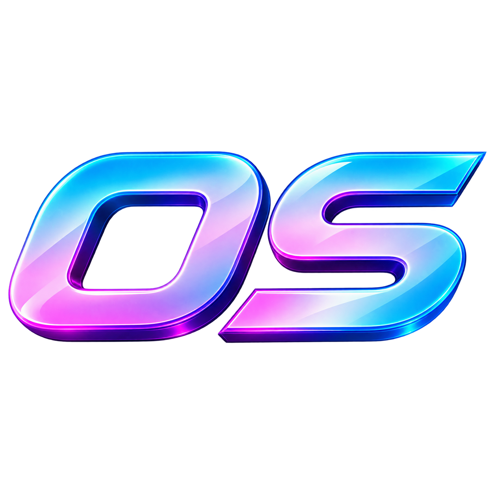

# OS Media Tool

Descargador interno de vídeo/audio de YouTube y Twitch para el equipo de OSUA. Electron + React + Vite + Tailwind.

## Desarrollo

```
npm install
npm run dev
```

Esto arranca el servidor de Vite y abre la ventana de Electron apuntando a él. La primera vez que arranca la app (en desarrollo o ya instalada) descarga automáticamente `yt-dlp`, `ffmpeg`/`ffprobe` y `deno` en la carpeta de datos de usuario — no hace falta instalarlos a mano.

## Generar el instalador de Windows

```
npm run dist
```

Genera `release\OS Media Setup <versión>.exe` (instalador NSIS, con acceso directo de Escritorio y entrada en el menú de inicio) y `release\win-unpacked\` (la app sin empaquetar, útil para pruebas rápidas).

No hay firma de código (no hay certificado de pago), así que Windows mostrará un aviso de SmartScreen la primera vez que alguien del equipo lo instale. Ver más abajo cómo saltarlo.

macOS: mismo comando, genera un `.dmg`. Tampoco está firmado, así que Gatekeeper avisará — ver más abajo.

## Saltar los avisos de Windows

Como el instalador no tiene firma de un certificado de pago (no porque sea inseguro), pueden salir dos avisos distintos, uno detrás de otro:

**1. Al descargarlo, el navegador (Edge/Chrome) puede avisar de "archivo poco común":**

- Pulsa **"Ver más"** en el aviso de descargas.
- Elige **"Mantener"** / **"Conservar de todos modos"**.

**2. Al ejecutar el instalador, Windows puede mostrar una pantalla azul "Windows protegió su PC":**

1. Pulsa **"Más información"**.
2. Aparecerá un botón **"Ejecutar de todas formas"** — púlsalo.

Solo hace falta pasar por esto la primera vez que se descarga/instala.

## Saltar el aviso de Gatekeeper en macOS

Al abrir la app por primera vez, macOS puede decir que no se puede abrir porque es de un "desarrollador no identificado". Para continuar:

1. Haz clic derecho (o Ctrl+clic) sobre la app y elige **"Abrir"**.
2. En el diálogo que aparece, pulsa **"Abrir"** otra vez.

Solo hace falta la primera vez.

## Estructura del proyecto

- `electron/` — proceso principal: gestión de binarios (yt-dlp/ffmpeg/deno), lanzamiento de descargas, IPC. Sin acceso del renderer a Node (`contextIsolation: true`, `nodeIntegration: false`), todo pasa por `electron/preload.js`.
- `src/` — interfaz en React, sin acceso directo a Node.
- `build/icon.png` — icono de la app (usado por electron-builder para generar el `.ico`/`.icns`).
- `public/favicon.png` — logo mostrado dentro de la app.

## Qué NO hace esta app

No soporta Spotify, Netflix ni ninguna plataforma con DRM. Toda la extracción la hace `yt-dlp`; esta app no incluye ningún extractor propio.

## Aviso legal

OS Media es una herramienta de uso personal/interno. No está permitido usarla para descargar, publicar o redistribuir contenido protegido por derechos de autor sin permiso de su titular. El uso de la aplicación es responsabilidad exclusiva de quien la usa; OSUA Studio no se hace responsable del uso que cada persona le dé.

---

<p align="center">
  
</p>
